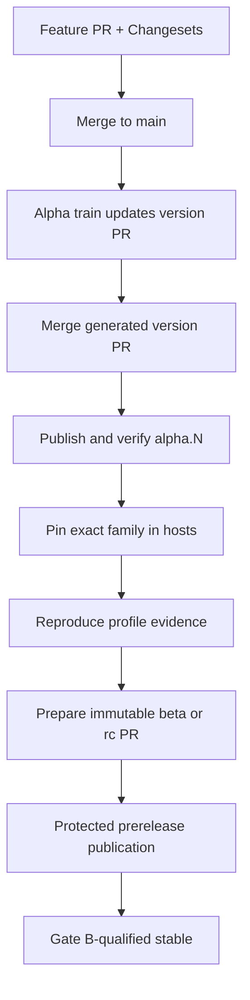

# Contributing to Kumwe Studio

This is the single working path for people and automated contributors. Studio is an eight-package standalone
page builder and host-integration product. A change is complete only when its contracts, implementation,
portable assertions, documentation, release intent, and verification agree.

## Product boundary

- `@kumwe/studio-core` owns deterministic artifacts, commands, sessions, and host negotiation without a DOM.
- `@kumwe/studio` owns the browser authoring shell and page-building experience. Editor.js remains behind its
  private canonical rich-text adapter.
- `@kumwe/studio-renderer-web` converts portable page intent into deterministic semantic HTML, scoped CSS, and
  trusted progressive-enhancement JavaScript. Every supported block retains an operable no-JavaScript fallback.
- Safe HTML import is normalized into bounded safe-markup structures. CSS authoring is limited to the governed
  scoped-style boundary. Portable artifacts never store arbitrary executable HTML/CSS/JavaScript, and authored
  JavaScript is not a content capability.
- A host such as Kumwe App supplies identity, policy, persistence, media, workflows, publication, and public
  delivery integration through the public ports. Host-specific code does not enter the reusable packages.
- All eight npm packages form one fixed release family and share one exact coordinate recorded in
  `studio-release.json`.

## One task lifecycle

| Step | Required action                                                                                                                                                         | Completion signal                                                  |
| ---: | ----------------------------------------------------------------------------------------------------------------------------------------------------------------------- | ------------------------------------------------------------------ |
|    1 | Read `AGENTS.md`, this file, and `docs/roadmap/STATUS.md`. Identify the affected contract, trust boundary, profile, and release impact.                                 | Scope names the authoritative files and tests.                     |
|    2 | Bootstrap from a full clone with the pinned Node/npm toolchain and Playwright Chromium.                                                                                 | `npm run doctor` passes.                                           |
|    3 | Run `npm run verify` before editing when practical. If the baseline is red, record the exact pre-existing failure.                                                      | Baseline is known rather than assumed.                             |
|    4 | Change the normative contract/schema/ADR first when public shape or behavior changes, then implementation and portable fixtures.                                        | Code and authority agree.                                          |
|    5 | Add focused unit/integration/browser coverage and a Changeset for every publishable package change.                                                                     | The changed behavior is measurable and version intent is explicit. |
|    6 | Run `npm run verify` and `npm run release:plan`. Review the diff for generated-record, package-family, security, accessibility, compatibility, and documentation drift. | Full local gate passes and release operation is understood.        |
|    7 | Open a pull request. Merge only after CI **Quality** and **Accessibility** pass.                                                                                        | Default branch contains a reviewed, green increment.               |
|    8 | Let the alpha release train maintain its version PR. Never hand-edit package versions, `.changeset/pre.json`, changelogs, lockfile pins, or release-record copies.      | One generated version PR represents the whole family.              |

## Environment setup

The supported contributor baseline matches CI: Node 24, npm 11.9.0, a non-shallow Git clone, locked npm
dependencies, and Playwright Chromium.

```bash
git clone https://github.com/kumwe/studio.git
cd studio
npm install --global npm@11.9.0
npm ci
npx playwright install chromium
npm run doctor
```

Linux machines missing browser system libraries may use `npx playwright install --with-deps chromium` with
the privileges appropriate to that machine. CI always uses `--with-deps`. Do not substitute another package
manager or regenerate `package-lock.json` with an unpinned npm version.

Every GitHub workflow uses the same `.github/actions/setup-studio` action for Node, npm, the lockfile install,
registry configuration, and optional Chromium setup. A workflow must not duplicate or bypass that environment.

## Change map

| Change                              | Start with                                                        | Required proof                                                                             |
| ----------------------------------- | ----------------------------------------------------------------- | ------------------------------------------------------------------------------------------ |
| Artifact/message shape              | `schemas/`, `docs/contracts/`                                     | Valid/invalid fixtures, schema copy/digest checks, protocol types/tests                    |
| Commands, sessions, migrations      | `packages/core/`, host/session contracts                          | Deterministic vectors, unit/property tests, failure/revision/idempotency lanes             |
| Page-builder authoring              | `packages/studio-lit/`, authoring contracts                       | Keyboard/pointer/explicit-control equivalence, browser journey, accessibility assertions   |
| Rich text, safe HTML, scoped styles | `packages/rich-text/`, governed-control contracts/ADRs            | Canonical round-trip, sanitization, CSP/Trusted Types, renderer projection, hostile inputs |
| Media/resources                     | `packages/media/`, host adapter/media contracts                   | Cancellation, retry, policy, persistence, hostile-media, accessibility, host replay        |
| Public rendering                    | `packages/renderer-web/`, renderer contract                       | Full catalog corpus, escaping, scoped CSS, no-script fallback, enhancement lifecycle       |
| Package/release tooling             | `.changeset/`, `scripts/release-*`, workflows, release governance | Fixed-family tests, dry-run pack/install, exact-channel guards, registry verification      |
| Kumwe App integration               | `docs/integration/kumwe-app.md` and the App adapter               | Exact release pin/record/digest, real host corpora, PHP/Twig/public-render replay          |

## Quality and tests

`npm run verify` is the contributor gate. It runs the repository check followed by the Chromium accessibility
and production-browser lane.

| Command                | What it proves                                                                                                                                 |
| ---------------------- | ---------------------------------------------------------------------------------------------------------------------------------------------- |
| `npm run doctor`       | Toolchain, full Git history, locked install, and browser availability                                                                          |
| `npm run check`        | Formatting, lint, TypeScript, boundaries/contracts/evidence/security/release drift, unit/property/Node tests, and production build             |
| `npm run check:a11y`   | CSP, production page, preview/render, responsive layout, measured canvas, keyboard parity, RTL/touch, reduced motion, reflow, and axe journeys |
| `npm run verify`       | The complete local contributor gate: `check` plus `check:a11y`                                                                                 |
| `npm run release:plan` | Whether the alpha train will maintain a version PR or publish a consumed coordinated release                                                   |

Passing tests proves repository behavior; it does not by itself claim a conformance profile or pass Gate A/B.
Accepted gate status lives only in `docs/roadmap/STATUS.md` and requires immutable reproduced evidence and the
specified human review.

## Version and release path

Every publishable change carries one truthful Changeset. The fixed group makes all eight package versions move
together; `npm run version-packages` is the only versioning implementation and also regenerates the lockfile,
changelogs, and all three release-record copies.



1. Normal merges accumulate Changesets on `main`.
2. **Alpha release train** runs on every `main` push. With pending Changesets it opens or updates the generated
   version PR without receiving npm credentials.
3. Merging that generated PR consumes the Changesets. The next train run authenticates, accepts only a
   coordinated numeric `alpha.N`, publishes all eight packages, verifies the complete set from npm, and repairs
   the `alpha` tag.
4. If a run was deleted or failed after credential rotation, manually dispatch **Alpha release train** from
   branch `main` with the exact current 40-character `main` SHA. A stale SHA or another branch fails closed.
5. Hosts pin that exact release and verify `studio-release.json` plus the corpus digest before integration
   qualification.
6. Beta/RC preparation is an explicit whole-family promotion PR after the required profile evidence. It never
   edits eight manifests by hand or reuses the alpha publisher. The first intended RC coordinate is
   `0.1.0-rc.1`; changing only the Changesets tag is forbidden because it would carry the alpha counter forward.
7. Prerelease publication uses a protected exact-candidate/evidence workflow and a channel-specific npm tag.
   Stable uses the same line only after Gate B accepts the exact candidate.

At present the alpha publisher is implemented. The evidence bundle and Gate B readiness workflows are
qualification tools, not publishers. The protected RC/stable publisher remains disabled until its evidence,
integrity, provenance, reviewer, and recovery guards are implemented and accepted; no contributor may work
around that boundary with `npm publish`.

## Pull-request checklist

- [ ] Authoritative contract/schema/ADR and implementation agree.
- [ ] Portable fixtures cover success, refusal, limits, and recovery where applicable.
- [ ] Accessibility, localization, security, compatibility, and host effects are addressed.
- [ ] Publishable changes have a truthful Changeset covering every affected package.
- [ ] `npm run verify` passes.
- [ ] `npm run release:plan` reports the expected operation/channel.
- [ ] Documentation describes implemented behavior separately from qualification or future work.

Report vulnerabilities through GitHub's private security-reporting path; never place exploit details or
sensitive findings in a public issue or pull request. By contributing, you agree that the contribution is
licensed under this repository's MIT License.
