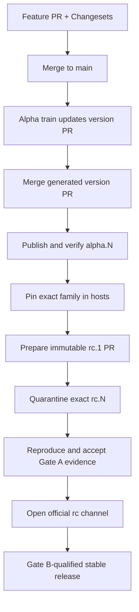

# Contributing to Kumwe Studio

This is the single working path for people and automated contributors. Studio is an eight-package standalone
page builder and host-integration product. A change is complete only when its contracts, implementation,
portable assertions, documentation, release intent, and verification agree.

## Product boundary

- `@kumwe/studio-core` owns deterministic artifacts, commands, sessions, and host negotiation without a DOM.
- `@kumwe/studio` owns the browser authoring shell and page-building experience. Editor.js remains behind its
  private canonical rich-text adapter.
- `@kumwe/studio-renderer-web` converts portable page intent into deterministic semantic HTML, scoped CSS, and
  trusted progressive-enhancement JavaScript. Every supported block retains an operable no-JavaScript fallback.
- Safe HTML import is normalized into bounded safe-markup structures. CSS authoring is limited to the governed
  scoped-style boundary. Portable artifacts never store arbitrary executable HTML/CSS/JavaScript, and authored
  JavaScript is not a content capability.
- A host such as Kumwe App supplies identity, policy, persistence, media, workflows, publication, and public
  delivery integration through the public ports. Host-specific code does not enter the reusable packages.
- All eight npm packages form one fixed release family and share one exact coordinate recorded in
  `studio-release.json`.

## One task lifecycle

| Step | Required action                                                                                                                                                         | Completion signal                                                  |
| ---: | ----------------------------------------------------------------------------------------------------------------------------------------------------------------------- | ------------------------------------------------------------------ |
|    1 | Read `AGENTS.md`, this file, and `docs/roadmap/STATUS.md`. Identify the affected contract, trust boundary, profile, and release impact.                                 | Scope names the authoritative files and tests.                     |
|    2 | Bootstrap from a full clone with the pinned Node/npm toolchain and Playwright Chromium.                                                                                 | `npm run doctor` passes.                                           |
|    3 | Run `npm run verify` before editing when practical. If the baseline is red, record the exact pre-existing failure.                                                      | Baseline is known rather than assumed.                             |
|    4 | Change the normative contract/schema/ADR first when public shape or behavior changes, then implementation and portable fixtures.                                        | Code and authority agree.                                          |
|    5 | Add focused unit/integration/browser coverage and a Changeset for every publishable package change.                                                                     | The changed behavior is measurable and version intent is explicit. |
|    6 | Run `npm run verify` and `npm run release:plan`. Review the diff for generated-record, package-family, security, accessibility, compatibility, and documentation drift. | Full local gate passes and release operation is understood.        |
|    7 | Open a pull request. Merge only after CI **Quality** and **Accessibility** pass.                                                                                        | Default branch contains a reviewed, green increment.               |
|    8 | Let the alpha release train maintain its version PR. Never hand-edit package versions, `.changeset/pre.json`, changelogs, lockfile pins, or release-record copies.      | One generated version PR represents the whole family.              |

## Environment setup

The supported contributor baseline matches CI: Node 24, npm 11.9.0, a non-shallow Git clone, locked npm
dependencies, and Playwright Chromium.

```bash
git clone https://github.com/kumwe/studio.git
cd studio
npm install --global npm@11.9.0
npm ci
npx playwright install chromium
npm run doctor
```

Linux machines missing browser system libraries may use `npx playwright install --with-deps chromium` with
the privileges appropriate to that machine. CI always uses `--with-deps`. Do not substitute another package
manager or regenerate `package-lock.json` with an unpinned npm version.

Every GitHub workflow uses the same `.github/actions/setup-studio` action for Node, npm, the lockfile install,
registry configuration, and optional Chromium setup. A workflow must not duplicate or bypass that environment.

## Change map

| Change                              | Start with                                                        | Required proof                                                                             |
| ----------------------------------- | ----------------------------------------------------------------- | ------------------------------------------------------------------------------------------ |
| Artifact/message shape              | `schemas/`, `docs/contracts/`                                     | Valid/invalid fixtures, schema copy/digest checks, protocol types/tests                    |
| Commands, sessions, migrations      | `packages/core/`, host/session contracts                          | Deterministic vectors, unit/property tests, failure/revision/idempotency lanes             |
| Page-builder authoring              | `packages/studio-lit/`, authoring contracts                       | Keyboard/pointer/explicit-control equivalence, browser journey, accessibility assertions   |
| Rich text, safe HTML, scoped styles | `packages/rich-text/`, governed-control contracts/ADRs            | Canonical round-trip, sanitization, CSP/Trusted Types, renderer projection, hostile inputs |
| Media/resources                     | `packages/media/`, host adapter/media contracts                   | Cancellation, retry, policy, persistence, hostile-media, accessibility, host replay        |
| Public rendering                    | `packages/renderer-web/`, renderer contract                       | Full catalog corpus, escaping, scoped CSS, no-script fallback, enhancement lifecycle       |
| Package/release tooling             | `.changeset/`, `scripts/release-*`, workflows, release governance | Fixed-family tests, dry-run pack/install, exact-channel guards, registry verification      |
| Kumwe App integration               | `docs/integration/kumwe-app.md` and the App adapter               | Exact release pin/record/digest, real host corpora, PHP/Twig/public-render replay          |

## Quality and tests

`npm run verify` is the contributor gate. It runs the repository check followed by the Chromium accessibility
and production-browser lane.

| Command                          | What it proves                                                                                                                                 |
| -------------------------------- | ---------------------------------------------------------------------------------------------------------------------------------------------- |
| `npm run doctor`                 | Toolchain, full Git history, locked install, and browser availability                                                                          |
| `npm run check`                  | Formatting, lint, TypeScript, boundaries/contracts/evidence/security/release drift, unit/property/Node tests, and production build             |
| `npm run check:a11y`             | CSP, production page, preview/render, responsive layout, measured canvas, keyboard parity, RTL/touch, reduced motion, reflow, and axe journeys |
| `npm run verify`                 | The complete local contributor gate: `check` plus `check:a11y`                                                                                 |
| `npm run release:plan`           | Whether alpha will version, publish, pause for RC, or wait to open the next post-stable train                                                  |
| `npm run release:promotion-plan` | Validates and classifies the manual RC/stable operation selected through `PROMOTION_*` environment inputs                                      |

Canonical schema changes use `npm run contracts:sync`; this also refreshes the package copies, manifest,
generated TypeScript models, corpus manifest, and release record. Do not edit generated models directly.
`npm run protocol:models:generate` and `npm run protocol:models:check` are focused diagnostic commands inside
that one lifecycle, not alternate contract or release paths.

Passing tests proves repository behavior; it does not by itself claim a conformance profile or pass Gate A/B.
Accepted gate status lives only in `docs/roadmap/STATUS.md` and requires immutable reproduced evidence and the
specified human review.

## Version and release path

Every publishable change carries one truthful Changeset. The fixed group makes all eight package versions move
together; `npm run version-packages` is the only versioning implementation and also regenerates the lockfile,
changelogs, and all three release-record copies.



1. Normal merges accumulate Changesets on `main`.
2. **Alpha release train** runs on every `main` push. With pending Changesets it opens or updates the generated
   version PR without receiving npm credentials.
3. Merging that generated PR consumes the Changesets. The next train run authenticates, accepts only a
   coordinated numeric `alpha.N`, uploads the exact approved tarballs under a version-scoped
   `studio-stage-*` tag, verifies the complete set and provenance from npm, and only then repairs the `alpha`
   tag. Changesets never publishes, creates a Git tag, or creates a GitHub release.
4. If a run was deleted or failed after credential rotation, manually dispatch **Alpha release train** from
   branch `main` with the exact current 40-character `main` SHA. A stale SHA or another branch fails closed.
5. Hosts pin that exact release and verify `studio-release.json` plus the corpus digest before integration
   qualification.
6. **Governed RC and stable promotion** is the only manual promotion entry point. RC preparation generates a
   reviewable PR for all eight packages. The explicit numeric transform makes any `0.1.0-alpha.N` become
   `0.1.0-rc.1`; changing only the Changesets tag is forbidden because it carries the alpha counter forward.
7. After the promotion PR merges, dispatch the same workflow with the exact RC `expected_main_sha`,
   `channel=rc`, and empty profiles/evidence SHAs. The protected `studio-rc` job publishes the immutable
   tarballs only under the coordinate-scoped `studio-stage-*` quarantine tag, verifies exact bits and source
   provenance, then installs all eight exact packages in a fresh unauthenticated npm consumer and audits their
   signatures. It does not move `rc` or `latest`, create a Git tag, or create a GitHub release. Because npm
   versions are immutable, run this only for the reviewed, frozen candidate; exact retries are idempotent.
8. **Evidence bundle** is supporting machinery, never a publisher. Generate bundles against that merged,
   quarantined RC candidate; Gate A criterion 13 executes the exact staged-registry clean-install proof.
   Reproduce bundles independently, commit accepted records in a later commit, and update
   `docs/roadmap/STATUS.md` only through the documented human review process. Retain the quarantine tag until
   official RC publication completes.
9. Dispatch the promotion workflow again to publish the exact RC. The protected `studio-rc` environment
   revalidates Gate A, the candidate/evidence ancestry, executable profile assertions, current `main`, all eight
   package pins, exact locally packed tarballs, npm provenance, the `rc` tag, and the GitHub release. Local
   artifacts and the registry preflight are prepared before `NPM_TOKEN` is made available. Official RC
   publication refuses to upload a missing coordinate: all eight exact packages must already have passed the
   quarantine proof. Only this operation moves `rc`, creates the source-bound GitHub release, and removes the
   quarantine tags after complete success.
10. A release-blocking RC correction carries non-empty, patch-only Changesets. Dispatching the same workflow
    with `channel` `rc` and no evidence SHAs creates the next generated coordinate (`rc.1` to `rc.2`). Feature,
    minor, and major work returns to the next alpha train. The corrected candidate needs fresh evidence; an RC
    is never overwritten.
11. Gate B qualifies the published RC. The promotion workflow first verifies Gate A and Gate B and creates the
    deterministic stable metadata PR, then a second exact-SHA dispatch publishes from its merged commit through
    the protected `studio-stable` environment and the npm `latest` tag.
12. Stable removes Changesets prerelease state. The alpha workflow then waits without error; the first later
    feature Changeset enters a fresh alpha train automatically, so release development does not dead-end. The
    Changeset selects the next semantic base (`0.1.0` plus a patch Changeset becomes `0.1.1-alpha.0`), and later
    version PRs on that train advance the numeric `alpha.N` counter.

### Promotion dispatch contract

| Intent                      | `expected_main_sha`                                        | `channel` | `profiles`                                    | `candidate_sha` / `gate_record_sha`             |
| --------------------------- | ---------------------------------------------------------- | --------- | --------------------------------------------- | ----------------------------------------------- |
| Prepare `rc.1`              | Exact current alpha `main`                                 | `rc`      | Non-empty comma-separated executable profiles | Both empty                                      |
| Prepare `rc.N+1` correction | Exact current RC `main` with Changesets                    | `rc`      | Empty                                         | Both empty                                      |
| Stage RC for Gate A proof   | Exact current frozen RC candidate at `main`                | `rc`      | Empty                                         | Both empty                                      |
| Publish RC                  | Exact current `main` containing the accepted Gate A record | `rc`      | Empty                                         | Exact RC candidate, then later evidence commit  |
| Prepare stable              | Exact current RC `main` containing accepted Gate A and B   | `stable`  | Empty                                         | Gate B-qualified RC, then later evidence commit |
| Publish stable              | Exact merged stable-promotion commit at `main`             | `stable`  | Empty                                         | Gate B-qualified RC, then its evidence commit   |

`profiles` accepts only these currently declared executable Version 2 IDs:
`studio.profile/binding-projection-v1`, `studio.profile/engine-core`,
`studio.profile/host-baseline`, `studio.profile/host-baseline-v2`,
`studio.profile/media-policy`, `studio.profile/preview-identity-v1`,
`studio.profile/renderer-web`, and `studio.profile/schema-property`. A whole-family RC may propose all eight as
one comma-separated value, but every listed profile must later appear in reproduced evidence and exactly match
the passing gate record. A profile label is not evidence: `evidence/profile-assertions.json` fixes the source
inputs and exact test lanes that each claim must reproduce. `studio.profile/authoring-web` is still a target and
is rejected.

Stable environment claims follow the same rule. `evidence/environment-assertions.json` covers every
`evidence/environment-matrix.json` identity and binds each executable variant to exact commands plus required
browser, operating-system, toolchain, host, PHP, and database metadata. At present only `node-npm-workspace` and
`generic-reference-host` have executable mappings. Chromium, Firefox, WebKit, Android, iOS, the three desktop
operating systems, a clean npm consumer, and the Kumwe App MariaDB/MySQL/PostgreSQL matrix remain target-only
and therefore block stable qualification. Dart/Flutter remains a non-blocking Version 3 target. A label such as
iOS backed by a Linux Chromium run cannot qualify.

The repository currently records Gate A as **Not assessed** and Gate B as **Blocked**. Therefore the promotion
workflow may prepare and quarantine an RC for exact registry evidence, but it correctly refuses to open the
official `rc` channel or publish stable today. A quarantine coordinate is not a support claim or a GitHub
release. Do not add placeholder claims, sample bundles, or invented gate records to make publication pass.

Preparation never receives npm credentials. Publication is retry-safe: all eight packages are packed once
before authentication and those exact retained bytes are rehashed immediately before upload. Missing packages
are published directly from the approved `.tgz` files under a nonofficial, version-scoped staging tag; an
already-published package is accepted only when its registry integrity and shasum equal the approved local
tarball and its npm attestation names the expected package bytes and workflow source. No official `alpha`,
`rc`, or `latest` tag moves until the complete family passes that verification. After channel reconciliation,
the workflow verifies the family again and removes only its own staging tag. Alpha reconciliation also removes
an erroneous prerelease `latest` tag left by legacy publication, but never overwrites or removes a stable
`latest`. An existing GitHub release must have the exact tag, title, notes, source commit, draft state, and
prerelease state. After rotating `NPM_TOKEN`, repeat the failed stage or official-publish dispatch with the same
exact inputs. If `main` moved, review the new head and dispatch with that exact SHA; a
superseded candidate or gate record fails closed.

Repository administrators must configure `studio-rc` and `studio-stable` as protected GitHub environments with
required maintainers/reviewers and deployment restricted to `main`. `NPM_TOKEN` must be scoped for publish and
dist-tag operations on `@kumwe`, and must never be exposed to pull requests or preparation jobs. Keep branch
protection on promotion PRs; the environment approval is an additional publication authorization, not a
substitute for review, evidence, or Gate A/B.

## Pull-request checklist

- [ ] Authoritative contract/schema/ADR and implementation agree.
- [ ] Portable fixtures cover success, refusal, limits, and recovery where applicable.
- [ ] Accessibility, localization, security, compatibility, and host effects are addressed.
- [ ] Publishable changes have a truthful Changeset covering every affected package.
- [ ] `npm run verify` passes.
- [ ] `npm run release:plan` reports the expected operation/channel.
- [ ] Documentation describes implemented behavior separately from qualification or future work.

Report vulnerabilities through GitHub's private security-reporting path; never place exploit details or
sensitive findings in a public issue or pull request. By contributing, you agree that the contribution is
licensed under this repository's MIT License.
