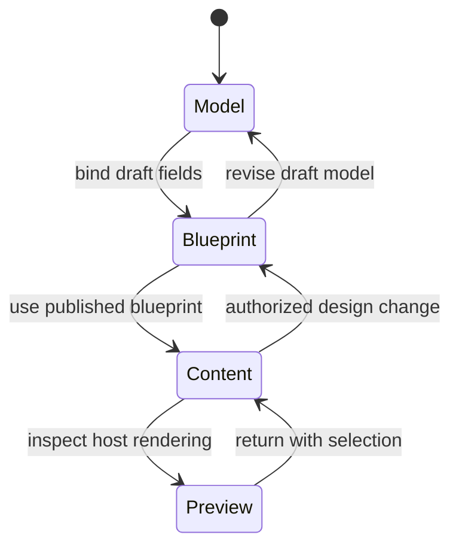

# Authoring experience

This section defines the intended Studio workspace closely enough for interaction design, package boundaries, commands, and host APIs to evolve together. It is a product specification, not evidence that every surface is implemented.

Studio has one workspace with three editing modes—Model, Blueprint, and Content. The session may set `composite: hybrid` to combine an authorized subset of Blueprint and Content operations, while `sessionState: read-only` permits inspection and recovery without mutation.

- **Model mode** describes or selects the typed data available to an experience.
- **Blueprint mode** arranges reusable structure, responsive intent, design recipes, bindings, and author permissions.
- **Content mode** populates a record without exposing structural choices that the blueprint does not allow.
- **Hybrid composition** is a negotiated composite of Blueprint and Content operations; it is not a fourth unrestricted editor.
- **Read-only state** is used for review, compatibility diagnostics, and recovery; it is not an editing mode.

Publication boundaries remain explicit. Moving from one mode to another does not silently publish a content model, blueprint, or entry.

## Experience promises

An author should be able to:

1. begin from a host definition, pattern, or empty permitted canvas;
2. find a block by purpose, data compatibility, or owning extension;
3. insert it by pointer, keyboard, or explicit command;
4. bind block ports to compatible fields or approved data sources;
5. select semantic responsive and appearance options offered by the active design profile;
6. edit bounded text and media in context;
7. see the host's actual server-rendered result at declared preview widths;
8. understand errors at the relevant node and recover without losing draft data;
9. save through host concurrency, validation, permission, workflow, revision, and audit rules.

See [workspace anatomy](workspace.md), [key journeys](journeys.md), and the [interaction model](interaction-model.md).
