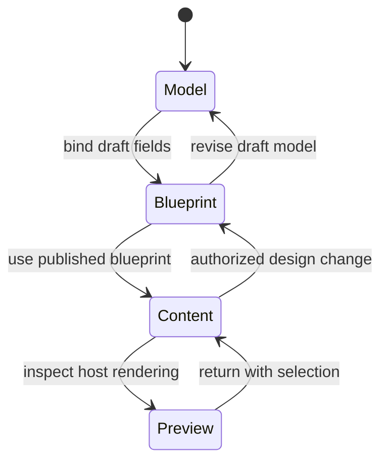

# Authoring experience

This section defines the target Studio workspace closely enough for interaction design, package boundaries,
commands, and host APIs to evolve together. The sole normative product requirements are in the
[product contract](../product-contract.md). This experience description is not evidence that every surface is
implemented (`STUDIO-PROD-014`).

The target Studio product is the central contextual editor launched from any eligible core or extension-declared
host target. It has one workspace with three editing modes—Model, Blueprint, and Content—and presents compatible
blocks, typed fields, and values on the same canvas. The session may set `composite: hybrid` to combine an
authorized subset of Blueprint and Content operations, while `sessionState: read-only` permits inspection and
recovery without mutation (`STUDIO-PROD-001`, `STUDIO-PROD-003`, and `STUDIO-PROD-008`).

## Current shipped shell boundary

The currently shipped shell surface is an integration candidate centered on existing Blueprint composition.
It projects an exact host content model read-only for field binding, and its composed host session does not yet
create or persist Model and Entry drafts. Blank/reusable coordinated starts, same-canvas value persistence,
item/type save choices, and inline-to-fullscreen session continuity are required planned work, not shipped
capabilities (`STUDIO-PROD-014`).

- **Model mode** describes or selects the typed data available to an experience.
- **Blueprint mode** arranges reusable structure, responsive intent, design recipes, bindings, and author permissions.
- **Content mode** populates a record without exposing structural choices that the blueprint does not allow.
- **Hybrid composition** is a negotiated composite of Blueprint and Content operations; it is not a fourth unrestricted editor.
- **Read-only state** is used for review, compatibility diagnostics, and recovery; it is not an editing mode.

Publication boundaries remain explicit. Moving from one mode to another does not silently publish a content model, blueprint, or entry.

## Contextual launch and continuity

For the target product, the host opens Studio directly from the item or extension-defined target the author is
working with. The author chooses a host-authorized blank start or one exact reusable type version. Inline,
minimized, maximized, and fullscreen presentations retain the same logical session, selection, focus recovery,
unsaved state, and history; changing presentation is not a copy, export, or second edit session
(`STUDIO-PROD-002`, `STUDIO-PROD-005`, `STUDIO-PROD-007`, and `STUDIO-PROD-012`).

## Experience promises

An author should be able to:

1. launch Studio from any authorized extension-declared host target without pre-creating companion artifacts;
2. begin from a blank coordinated definition or one exact reusable type version;
3. find a block or typed field by purpose, data compatibility, or owning extension;
4. insert blocks and fields by pointer, keyboard, or explicit command and edit permitted values in the same
   contextual canvas;
5. bind block ports to compatible fields or approved data sources;
6. select semantic responsive and appearance options offered by the active design profile;
7. edit bounded text and media in context;
8. see the host's actual server-rendered result at declared preview widths;
9. understand errors at the relevant node and recover without losing draft data;
10. explicitly choose **save item**, **save as new type**, or **save new type version**, with Model, Blueprint,
    and Entry consequences shown before confirmation; and
11. complete each save through host concurrency, validation, permission, workflow, revision, and audit rules.

Every pointer path has a complete keyboard and explicit-control equivalent. Product qualification requires an
executable end-to-end journey covering contextual launch, authoring, presentation continuity, all applicable
save choices, host refusal, and accepted persistence (`STUDIO-PROD-013` and `STUDIO-PROD-015`).

See [workspace anatomy](workspace.md), [key journeys](journeys.md), the [interaction model](interaction-model.md), and the [keyboard reference](keyboard.md).
