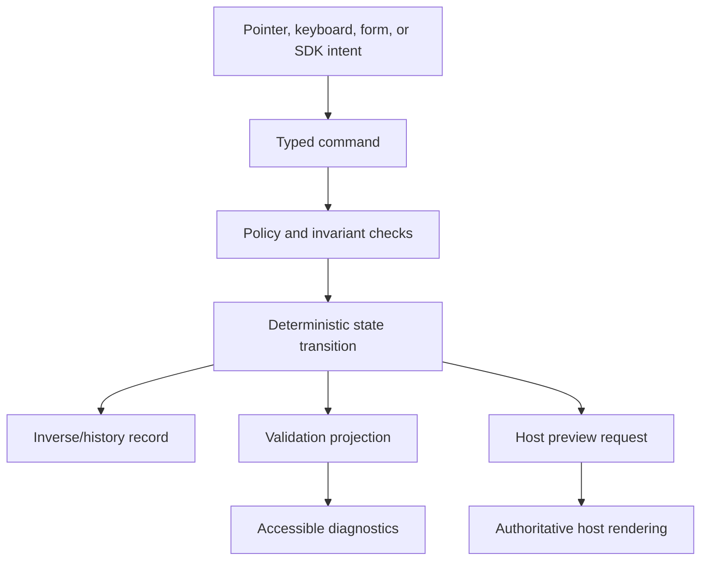

# Interaction model

Studio interactions are projections of serializable commands over immutable draft state. UI components dispatch intent; they do not mutate the protocol tree directly.

## Command path

Commands identify artifact version, target node or field, operation, arguments, actor/session context supplied by the host, and idempotency/concurrency metadata where required by the relevant boundary. The portable reducer cannot authorize an actor; it can reject structurally invalid intent and preserve deterministic behaviour.

## Selection and focus

- Selection is application state; DOM focus is an accessibility mechanism. Changing one must not unexpectedly destroy the other.
- Canvas, Outline, and Inspector represent the same selected node and stable path.
- After insert, move, or delete, focus moves to a documented logical target and is announced when necessary.
- Nested interactive previews have an explicit edit/operate boundary so an author can select a block without accidentally activating it.
- Escape unwinds the current interaction layer; it never silently discards a draft.

## Placement and movement

Every placement operation resolves to `parent slot + ordered position`. Pointer drag, keyboard move mode, Outline buttons, and host automation issue the same command form. Valid targets come from block slot constraints, policy, and compatibility; visual geometry cannot create an otherwise invalid tree.

Keyboard movement must support:

- select and enter move mode;
- enumerate valid destinations without requiring spatial inference;
- move before, after, or into a compatible slot;
- cancel without mutation;
- announce the result and new position.

## Sizing and responsive intent

Handles select a bounded semantic value supported by the active layout block and design profile. A handle may feel direct, but it snaps to allowed spans/roles and exposes the identical choice in the Inspector. Exact pointer coordinates are transient UI state and never serialized.

## Inline editing

Inline editing is limited to a block's declared editable ports. Rich text uses a bounded document schema and deterministic JSON, with paste normalization and host-side validation. Structural shortcuts do not fire while a text editor owns the relevant keystroke. Content values and blueprint defaults remain distinct.

## History

Undo and redo operate on accepted local commands and their inverses, not DOM snapshots. Host save, workflow, publication, and remote collaboration boundaries are visible in history. A command that cannot be safely replayed against a new base revision produces a conflict; it is not silently dropped or coerced.

## Diagnostics and recovery

Errors have stable codes, severity, artifact path or node identity, translated message keys, and optional safe recovery actions. The interface supplies a summary and contextual markers. Raw server exceptions, secret values, and untrusted markup are never rendered as diagnostic content.

Draft recovery preserves the last known valid serialized artifact and the command journal required by policy. Recovery storage is host-controlled or explicitly negotiated; Studio never assumes that local browser storage is an authorized persistence tier.
