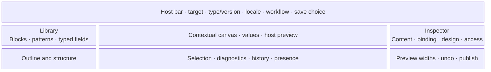

# Workspace anatomy

The target Studio interface is an accessible, host-embeddable contextual workspace. A host may place the same
logical session inline, minimized, maximized, or fullscreen within its own navigation, but may not alter
protocol meaning or remove required recovery and accessibility operations (`STUDIO-PROD-007` and
`STUDIO-PROD-013`). See the sole normative [product contract](../product-contract.md).

### Current Studio-side implementation boundary

The contextual shell implements the coordinated Model/Blueprint/Entry snapshot, blank/from-type/existing
starts supplied by its runtime, Entry value editing, the current additive Model-field control, all three save
choices, and inline/minimized/maximized/fullscreen state on one mounted session. Its hosted runtime sends save
plans and accepted choices through the configured authoritative adapter; its standalone runtime downloads the
same bounded intent without claiming persistence.

The Blueprint shell now keeps one rendered page canvas mounted while Model, Blueprint, and Content controls
change: standalone mounts, and hosted mounts whose resolved session enables no host preview, render the
admitted composition through the public semantic web renderer in an isolated local canvas labelled as
non-authoritative, with measured selection, responsive target widths, and the same measured drop indicator
for palette insertion and block movement. The inspector is docked beside that canvas and leads with typed
port and property controls, Layout size roles at the active viewport, and the Model and Content panels;
raw JSON editing sits behind an `Advanced properties and bindings` disclosure. Narrow containers present
the Library, Outline, and Inspector as mutually exclusive sheets behind a visible pane switcher while the
canvas stays central. Inline value editing is contextual: activating a rendered block focuses its typed
control; the rendered markup itself is never editable in place, and no editor geometry or CSS enters a
Blueprint.

The complete region and interaction specification below remains the product and qualification boundary.
Implementing a component state is not proof of host navigation continuity, complete field tooling, manual
accessibility, or the integrated `STUDIO-PROD-015` journey (`STUDIO-PROD-014`).

## Target large-screen composition

This diagram expresses regions, not fixed pixels. Hosts and design profiles may alter density and placement through declared capabilities. The workspace must remain usable at zoom, with long translated labels, in RTL, and without relying on color or pointer precision.

| Region    | Responsibility                                                                                     | Required alternatives                                              |
| --------- | -------------------------------------------------------------------------------------------------- | ------------------------------------------------------------------ |
| Host bar  | Target context, exact type/version, locale, workflow, presentation state, and explicit save choice | Standard links and form controls supplied by the host              |
| Library   | Searchable blocks, patterns, typed fields, and extension provenance                                | Insert-before/after/inside/bind commands and keyboard navigation   |
| Canvas    | Direct block/field placement, permitted value editing, resize intent, and host-rendered preview    | Outline tree and inspector expose every operation                  |
| Outline   | Complete semantic tree, slots, hidden/unresolved nodes, errors                                     | Move up/down/in/out, duplicate, delete, and select controls        |
| Inspector | Typed properties, bindings, responsive roles, design recipes, policy, accessibility metadata       | Schema-generated labels, descriptions, errors, and ordinary inputs |
| Status    | Validation, compatibility, save state, conflicts, history, and optional collaboration              | Persistent textual status and focusable error navigation           |

## Narrow screens

On a narrow viewport, the Canvas remains central and Library, Outline, and Inspector become mutually exclusive sheets or routes. Selection and unsaved state persist across region changes. Dragging may be unavailable; explicit structural commands remain complete. Preview width represents the target experience, not the physical editor width.

## Contextual host handoff

The target host may change the workspace among inline, minimized, maximized, and fullscreen presentations
without replacing the authorized target or creating a second draft. Selection, keyboard focus recovery, active
mode, pending field input, unsaved state, history, diagnostics, and preview identity remain continuous. A return
to host chrome is an explicit navigation action; it does not imply save, discard, publish, or session disposal
(`STUDIO-PROD-001`, `STUDIO-PROD-007`, and `STUDIO-PROD-012`).

The contextual shell preserves the same drafts and local state while its presentation value changes. A host
still must prove focus recovery, route/frame handoff, dirty-navigation policy, authority, and deterministic
return context; ordinary custom-element embedding is not complete host-continuity evidence.

## Canvas semantics

The Canvas is not a free-form pixel surface. In the target product it coordinates a block tree, compatible typed
fields, authorized Entry values, and the active design profile without merging their artifacts:

- insertion targets correspond to declared slots;
- compatible blocks and typed fields can be placed or bound through pointer, keyboard, and explicit controls;
- a field placement changes only the authorized Model/Blueprint draft concerns, while value editing changes the
  separately versioned Entry draft;
- sizing controls choose bounded semantic spans or responsive roles;
- color and typography controls choose declared tokens or recipes;
- field chips represent typed bindings, not copied placeholder values;
- missing contributions remain visible as inert, diagnosable nodes with preserved data;
- preview-only identifiers map rendered elements back to blueprint node IDs and are never published.

For a four-column region, the document might express `wide: 4`, `medium: 2`, and `narrow: 1`. A design profile maps those roles to its renderer and styles. The document never stores grid utility classes, media-query pixels, or generated CSS.

## Mode-specific controls

| Concern     | Model                                                             | Blueprint                                            | Content                                         |
| ----------- | ----------------------------------------------------------------- | ---------------------------------------------------- | ----------------------------------------------- |
| Fields      | Create/edit an authorized draft or inspect a published definition | Bind compatible fields to block ports                | Populate fields allowed by the blueprint        |
| Structure   | Describe repeatability and relationships                          | Insert, nest, order, and constrain blocks            | Reorder only where explicitly allowed           |
| Design      | Declare semantic presentation hints only where the host permits   | Select profile recipes, tokens, and responsive roles | Choose only exposed editorial variants          |
| Publication | Publish a new host definition version                             | Publish an immutable blueprint version               | Save or advance the entry through host workflow |

Modes select permitted controls and the artifact targeted by a command. They do not replace the rendered page
with a separate form as the ordinary content-editing experience. The same canvas, selected node, viewport,
history, and unsaved draft remain visible and continuous while compatible content and design controls change.
A bound value edit targets the Entry field; it must not silently replace that binding with a static value in
the Blueprint. Definition-wide changes remain explicitly identified as Model or reusable-type work.

## Explicit save outcomes

The target host bar presents distinct actions rather than an ambiguous universal Save
(`STUDIO-PROD-004`–`STUDIO-PROD-006`):

- **Save item** submits Entry values and permitted composition for the exact hydrated reusable type version.
- **Save as new type** submits separately versioned Model and Blueprint drafts and excludes Entry values.
- **Save new type version** requests new host-governed Model and/or Blueprint successor revisions under
  migration and compatibility policy; it never rewrites a published revision in place.

The host may withhold an action according to context and permission, but Studio never substitutes one action
for another. Before confirmation Studio identifies affected artifacts and consequences; after acceptance it
reconciles the host-returned revisions and the exact successor return context bound into the confirmed plan.
It retains the earlier return context after cancellation or refusal and rejects a result whose return context
does not match that plan. Identity allocation, validation, authorization, persistence,
revisioning, audit, publication, and failure recovery remain host responsibilities (`STUDIO-PROD-006` and
`STUDIO-PROD-010`).

## Preview

The preferred web preview is rendered by the host in a separately secured, same-origin context and coordinated through the versioned preview protocol. Studio sends bounded draft artifacts; the host revalidates, resolves bindings, and renders its real template stack. A static local projection may help while disconnected, but must be labeled non-authoritative.

Standalone mounting must supply a local rendered canvas for its admitted catalog without an application
adapter, persistence service, network request, or reference-host-only initialization. Local rendering is not
an authoritative host preview. Configured hosted failures must never silently create a standalone session,
claim a host save, or display a local projection as accepted host output.

## Observable canvas acceptance

These checks refine the existing `STUDIO-PROD-002`, `003`, `007`, `012`, `013`, and `015` outcomes; they do not
replace the canonical acceptance journey or constitute accepted gate evidence. Run them against the public
mount API and distributed browser entry point, not only a test harness that supplies missing editor behavior.

| Journey                                       | Observable result                                                                                                                            |
| --------------------------------------------- | -------------------------------------------------------------------------------------------------------------------------------------------- |
| Open an ordinary standalone mount             | A genuine empty rendered workspace appears, ready to insert into; a structural list is not its visual canvas.                                |
| Insert a section, heading, image, and button  | Palette clicks, keyboard insertion, and palette-to-canvas drops produce visible rendered blocks and the same valid document operations.      |
| Select a nested rendered block                | Canvas, layer tree, parent breadcrumb, and contextual inspector identify the same stable node.                                               |
| Edit a bound value or static block content    | The canvas stays visible, displays the changed value, and preserves binding identity and artifact authority.                                 |
| Move or resize a block                        | Placement respects slots and policy; resizing selects supported semantic values at the active viewport. A cancelled gesture changes nothing. |
| Undo and redo                                 | One completed gesture is one reversible semantic operation; DOM snapshots and pointer coordinates are not saved artifacts.                   |
| Change viewport or presentation               | The intended responsive output changes without losing selection, history, pending edits, or the resource context.                            |
| Export and reopen locally                     | The same visible composition and values return in a fresh isolated instance without network access.                                          |
| Save, reopen, and publish through a real host | Host-accepted artifacts reproduce the authored content, layout, theme, and responsive behavior through the public renderer.                  |
| Refuse a host operation or contribution       | The error is explicit, unsaved work remains recoverable under policy, and no substitute authority or renderer is fabricated.                 |

The representative browser page must contain nested layout and content, not only an empty section. Automated
accessibility checks supplement keyboard, focus, touch, RTL, zoom, and visual review; they do not substitute
for proving the rendered interactions above. Interface-ready status requires an operational canvas or a
usable empty canvas, not merely attachment of a chooser or custom element.
