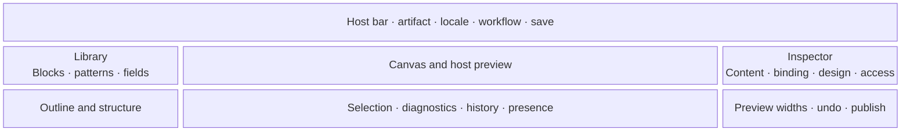

# Workspace anatomy

The reference Lit interface is an accessible, host-embeddable workspace. A host may place it within its own navigation, but may not alter protocol meaning or remove required recovery and accessibility operations.

## Large-screen composition

This diagram expresses regions, not fixed pixels. Hosts and design profiles may alter density and placement through declared capabilities. The workspace must remain usable at zoom, with long translated labels, in RTL, and without relying on color or pointer precision.

| Region    | Responsibility                                                                               | Required alternatives                                              |
| --------- | -------------------------------------------------------------------------------------------- | ------------------------------------------------------------------ |
| Host bar  | Context, immutable version identities, locale, workflow, save/publish request                | Standard links and form controls supplied by the host              |
| Library   | Searchable blocks, patterns, fields, and extension provenance                                | Insert-before/after/inside commands and keyboard navigation        |
| Canvas    | Direct selection, placement, editing, resize intent, and host-rendered preview               | Outline tree and inspector expose every operation                  |
| Outline   | Complete semantic tree, slots, hidden/unresolved nodes, errors                               | Move up/down/in/out, duplicate, delete, and select controls        |
| Inspector | Typed properties, bindings, responsive roles, design recipes, policy, accessibility metadata | Schema-generated labels, descriptions, errors, and ordinary inputs |
| Status    | Validation, compatibility, save state, conflicts, history, and optional collaboration        | Persistent textual status and focusable error navigation           |

## Narrow screens

On a narrow viewport, the Canvas remains central and Library, Outline, and Inspector become mutually exclusive sheets or routes. Selection and unsaved state persist across region changes. Dragging may be unavailable; explicit structural commands remain complete. Preview width represents the target experience, not the physical editor width.

## Canvas semantics

The Canvas is not a free-form pixel surface. It projects a block tree and the active design profile:

- insertion targets correspond to declared slots;
- sizing controls choose bounded semantic spans or responsive roles;
- color and typography controls choose declared tokens or recipes;
- field chips represent typed bindings, not copied placeholder values;
- missing contributions remain visible as inert, diagnosable nodes with preserved data;
- preview-only identifiers map rendered elements back to blueprint node IDs and are never published.

For a four-column region, the document might express `wide: 4`, `medium: 2`, and `narrow: 1`. A design profile maps those roles to its renderer and styles. The document never stores grid utility classes, media-query pixels, or generated CSS.

## Mode-specific controls

| Concern     | Model                                                             | Blueprint                                            | Content                                         |
| ----------- | ----------------------------------------------------------------- | ---------------------------------------------------- | ----------------------------------------------- |
| Fields      | Create/edit an authorized draft or inspect a published definition | Bind compatible fields to block ports                | Populate fields allowed by the blueprint        |
| Structure   | Describe repeatability and relationships                          | Insert, nest, order, and constrain blocks            | Reorder only where explicitly allowed           |
| Design      | Declare semantic presentation hints only where the host permits   | Select profile recipes, tokens, and responsive roles | Choose only exposed editorial variants          |
| Publication | Publish a new host definition version                             | Publish an immutable blueprint version               | Save or advance the entry through host workflow |

## Preview

The preferred web preview is rendered by the host in a separately secured, same-origin context and coordinated through the versioned preview protocol. Studio sends bounded draft artifacts; the host revalidates, resolves bindings, and renders its real template stack. A static local projection may help while disconnected, but must be labeled non-authoritative.
