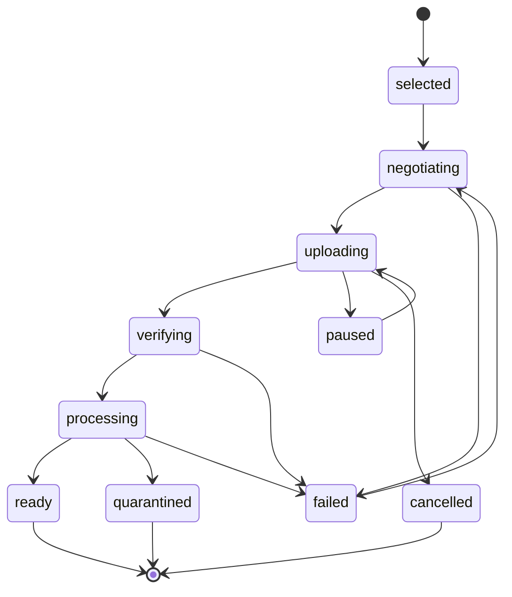

# Media architecture and experience

This document specifies the complete target media authoring experience and its Gate A/Gate B obligations; it
does not claim that the current alpha package implements every surface. Studio does not become the authoritative
media service. This division lets Kumwe App solve its current clunky Version 2 web authoring workflow while
allowing Studio to work with another CMS, DAM, object store, or desktop application. Native Flutter hosts are
Version 3 targets.

## Ownership decision

| Studio owns                                                              | Host media service owns                                             |
| ------------------------------------------------------------------------ | ------------------------------------------------------------------- |
| Media browser, search, selection and collection UI                       | Authoritative asset identity and tenant/site ownership              |
| Drag/drop, paste and picker interaction                                  | Authentication, authorization and policy filtering                  |
| Upload intent, progress, cancel, retry and failure UI                    | Upload-session creation, byte transport and durable commit          |
| Schema-driven media-field/inspector controls                             | Storage, encryption, malware/content scanning and quarantine        |
| Alternative-text, decorative, caption and focal-point authoring controls | Metadata validation, version history, audit and moderation          |
| Rendition/crop preview and responsive-use intent                         | Decoding, metadata stripping, transforms, renditions and checksums  |
| Replacement/reference-impact presentation                                | Reference index, retention, deletion, restore and legal hold        |
| Portable stable media-reference shape                                    | Private/public delivery policy, signed URLs and CDN/origin handling |
| Media port types, diagnostics and conformance tests                      | Rate limits, quotas, lifecycle jobs, backup/restore and operations  |

The table assigns target ownership. The current alpha implements the Studio side of this boundary: the
host-neutral provider, cancellation-safe browse/search/pagination and upload state, rendition selection,
media-field controller, and shell controls for browse, select, replace, paste/drop/upload, progress,
cancellation, retry, ordering, metadata, and orphan recovery. That repository-verified runtime is not yet a
supported host claim. Gate qualification still needs a real persistent host adapter, hostile-media and
supported-browser evidence, lifecycle/recovery drills, and independent reproduction. The authoritative media
application/domain/infrastructure remains in [`kumwe/app`](https://github.com/kumwe/app) and is exposed by the
Kumwe App adapter for Studio. A separate media repository is unnecessary unless Kumwe App later decides to
extract its entire media service for reasons independent of Studio.

## Portable media reference

A stored `0.1-draft` MediaReference identifies an accepted asset and presentation intent. Its closed canonical
schema permits exactly:

- `contractVersion` and the `media-reference` kind discriminator;
- opaque stable `assetId` and optional pinned `assetRevision`;
- required namespaced semantic `usage`;
- optional rendition intent containing a semantic role, bounded fit, and preferred media types;
- optional normalized focal point;
- optional aspect-ratio or normalized-rectangle crop intent; and
- exactly one usage-specific accessibility form: informative alternative text with optional bounded caption,
  explicit decorative state, or field bindings for alternative text and optional caption.

Media kind, alignment, credit/license values, arbitrary public metadata, and a generic extension map are not
fields in the current MediaReference. Media kind comes from the authorized MediaAsset projection.
Extension-specific presentation data belongs in the containing field or block property under its own bounded,
registered schema. Adding another media-reference field requires an explicit Gate A schema decision rather
than an extension of this list in prose.

It never stores:

- temporary upload IDs after commit;
- filesystem or object-store paths;
- bearer tokens, cookies or signed/expiring URLs;
- raw bytes or base64 payloads;
- transform commands, shell arguments or arbitrary CDN parameters;
- untrusted SVG/HTML/script;
- private EXIF/location/camera/owner metadata;
- host database IDs whose structure grants or implies access; or
- a URL as a substitute for authoritative asset identity.

The host resolves a reference for preview or delivery under current actor/surface policy. A reference remaining
in a document does not grant access to the asset.

## Media port capabilities

Capabilities are separately versioned and deny-by-default:

| Capability       | Contract behaviour                                                                                                          |
| ---------------- | --------------------------------------------------------------------------------------------------------------------------- |
| Browse/search    | Cursor-based bounded result, declared sort/filter facets, policy-safe counts, cancellation and empty/error states           |
| Select           | Validate media kind, field/block constraints, actor access and accepted processing state before returning a reference       |
| Upload           | Negotiate limits/accepted types, create session, stream chunks/bytes, report progress, cancel/retry and commit idempotently |
| External import  | Optional explicit capability; allowlisted origins and server-side retrieval/scanning, never authoring-client trust          |
| Clipboard/drop   | Converts local input to an upload session; never embeds data URLs in the artifact                                           |
| Processing       | Stable queued/scanning/processing/ready/quarantined/failed states with safe progress and retry policy                       |
| Metadata         | Read/write only permitted fields with expected revision, validation, localization and audit                                 |
| Focal point/crop | Persist normalized authoring intent; host validates and produces declared renditions                                        |
| Renditions       | Return preview descriptors and intrinsic dimensions without exposing storage internals                                      |
| Replace/version  | Show reference impact and host policy; preserve stable ID only if host semantics guarantee compatibility                    |
| Delete/restore   | Host-authorized lifecycle operation with reference impact, retention/legal-hold result and no UI-side cascade               |
| Collections      | Optional owner-aware albums/folders/tags that never become authorization boundaries by assumption                           |

A Studio session exposes only supported capabilities. Missing upload does not disable browsing; missing metadata
write does not pretend an edit succeeded.

## Upload state machine

Every upload follows explicit states:

An accepted upload may yield a stable committed asset identity while it is still `processing`; whether Studio
may bind, preview, save, publish, or deliver that identity is separately controlled by host policy. `ready`
means the asset is eligible for the operations authorized by that policy. Rejected and quarantined identities
remain available for safe diagnostics and cleanup but are never valid content use. A host may return an
existing asset after checksum deduplication, but Studio shows that outcome and uses the host-returned identity.

### Upload requirements

- The host validates declared type, detected type, extension, size, dimensions/duration, quota and permission.
- Streaming/chunking is bounded and supports cancellation; the client does not buffer arbitrary files.
- Retry uses upload-session/chunk identities and does not duplicate committed assets.
- Progress distinguishes transfer from scan/processing time.
- Closing Studio leaves an explicit resumable, cancelled or host-cleanup outcome.
- Quarantine exposes a safe reason/category, not the quarantined payload or scanner internals.
- File names are display metadata, normalized and escaped; they never determine a storage path.
- Preview occurs only after the host supplies a safe accepted rendition or an explicitly sandboxed local preview
  allowed by policy.

## Author experience

The first release media surface includes:

- browse, search, sort, approved filters, collection navigation and recent assets;
- grid/list views with useful accessible names and processing/access state;
- upload by file picker, keyboard, drag/drop and paste where capability permits;
- multi-file queue with per-item and aggregate progress, cancellation and retry;
- inline validation before transfer plus authoritative host validation results;
- required alternative text, explicit decorative choice, caption/credit and focal point controls;
- intrinsic dimensions, aspect ratio, media kind, safe file size and rendition preview;
- replace/remove/undo decisions that distinguish removing a reference from deleting an asset;
- reference-impact warning supplied by the host without leaking hidden resources/counts;
- broken, denied, missing, quarantined and processing placeholders with recovery actions; and
- responsive image/video intent expressed through theme/block recipes rather than raw markup.

Image uploads are not the whole media model. The contract accommodates image, video, audio, document and
host/plugin-defined kinds, but each block/field advertises the kinds it accepts. Executable and active-content
formats are deny-by-default.

## Accessibility requirements

- The Version 2 browser surface provides every semantic operation without drag/drop. A Version 3 native Flutter
  claim must prove the same applicable operation set.
- Grid/list items expose name, kind, state and selection; multi-select state is announced.
- Progress is announced without flooding live regions; cancellation remains reachable.
- Alternative-text guidance distinguishes purpose from filename and permits decorative state only when the
  consuming block/field allows it.
- Focal-point controls have numeric/directional alternatives and do not rely only on a pointer.
- Crop/rendition preview communicates that source bytes are unchanged unless the host says otherwise.
- Errors identify the asset and correction, preserve valid metadata, and return focus predictably.
- Zoom, reflow, large text, contrast, reduced motion, keyboard and supported screen readers are qualified.

Studio can warn about missing text, contrast evidence, autoplay or caption requirements; the host renderer and
publication workflow enforce the final accessibility policy.

## Privacy and security

Media is hostile input until the host accepts a processed rendition. The integration must cover:

- decompression bombs, malformed codecs, polyglots, spoofed MIME types and oversized dimensions/duration;
- SVG/HTML/XML/script, macro-bearing documents and active metadata;
- EXIF/GPS/private metadata stripping or explicit retention policy;
- cross-tenant/site reference guessing and signed-URL leakage;
- content scanning, quarantine, moderation and reprocessing after scanner changes;
- request forgery and internal-network access during external import;
- unsafe filenames, content disposition, content type and inline delivery;
- preview sandbox and CSP;
- quota/rate/depth/count bounds and abandoned upload cleanup;
- audit without recording bytes, tokens, private URLs or sensitive metadata; and
- retention, deletion, restore, backup and legal-hold behaviour.

Studio diagnostics identify the failed operation and safe reason. Raw scanner output, storage paths, credentials,
private URLs and hidden asset existence do not reach untrusted clients.

## Lifecycle and references

An asset and a document have independent lifecycles. Removing a block reference does not delete the asset.
Deleting/replacing an asset does not rewrite documents from the client.

The host maintains reference impact across published/draft/revision/translation/business contexts under policy.
When an asset is unavailable, Studio retains the stable reference, shows its state, and offers authorized
replace/remove/restore actions. Public renderers follow declared fallback policy without leaking why a private
asset is inaccessible.

Media references and metadata changes use expected revisions. Concurrent focal-point, alternative-text or
replacement edits return structured conflicts; last-write-wins is not the default.

## Offline and Flutter behaviour

This section defines Version 3 native-profile requirements and does not block Version 2.

Offline media staging is an optional host capability. It requires encrypted local custody, bounded quotas,
stable staging IDs, cancellation/cleanup, reconnection conflict rules and a prohibition on publication before
host acceptance. A local file path is never serialized as a portable media reference.

Dart/Flutter ports stream files and progress without reading unbounded bytes into memory. Mobile pickers,
camera/photo permissions and background transfer are host adapter concerns. Native and web clients consume the
same accepted reference and processing-state semantics.

## Media Gate A criteria

1. Reference, upload-session, result, processing-state, metadata and diagnostic schemas are complete.
2. Studio/host/renderer ownership is unambiguous.
3. Capability negotiation and finite limits cover every optional operation.
4. Stable identity, version/replacement, permission and reference-impact semantics are declared.
5. Security/privacy threat fixtures and accessibility requirements are executable.
6. TypeScript models round-trip the canonical corpus. Version 3 adds Dart parity before a native profile claim.
7. Generic-host and Kumwe App adapters map every port without leaking storage/runtime internals.

## Media Gate B criteria

1. The Version 2 web experience completes browse, upload, process, select, metadata, focal-point, replace and
   failure/recovery workflows for `studio.profile/authoring-web`. Version 3 separately qualifies the Flutter
   experience before claiming `studio.profile/authoring-flutter`.
2. Real host adapters prove streaming, idempotent retry, cancellation, conflict, permission change, quarantine,
   lifecycle and orphan cleanup.
3. Malicious media corpus, CSP, cross-tenant, URL leakage, quota and resource-exhaustion tests fail closed.
4. Accessibility and localization matrices pass with keyboard, touch and supported screen readers.
5. Old references and migrations remain readable; unsupported kinds cannot be silently lost.
6. Public delivery uses trusted host renditions and works without Studio.
7. Performance budgets cover browse, thumbnails, concurrent uploads, processing updates and large collections.
