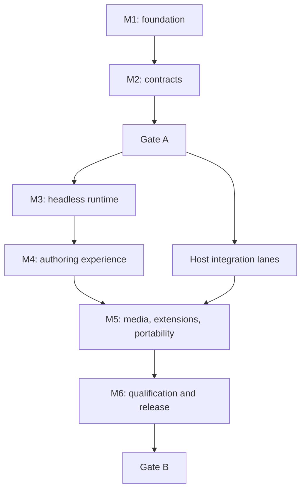

# Studio delivery programme

This roadmap is the authority for taking Studio from a documented product boundary to a portable,
production-qualified authoring platform. It covers the first six months of delivery. Calendar targets set
tempo; acceptance evidence decides whether work advances. A month ending does not relax a dependency or
promote a gate.

Studio is a schema-aware composition system, not a browser for writing arbitrary HTML, CSS, JavaScript, or
host templates. It gives authors a visual canvas while preserving typed content, reusable blueprints,
host-owned policy, theme-owned design choices, deterministic rendering, and a portable, versioned protocol.

The programme is deliberately larger than an MVP. Gate B represents a useful, supportable first product:
headless core, Lit authoring shell, generic host adapters, extension and theme integration, media and rich
text, TypeScript and Dart portability, conformance tooling, and a qualified Kumwe integration profile.

## Programme invariants

Every work package and gate preserves these rules:

1. The language-neutral protocol and its published schemas are authoritative. The Lit interface is the
   reference web client, not the data model.
2. Hosts own authentication, authorization, persistence, workflow, publication, rendering, media storage,
   template execution, and audit. Studio accesses those capabilities only through declared host ports.
3. Documents contain bounded typed data and references. They never contain executable JavaScript, Twig,
   unrestricted HTML/CSS, SQL, credentials, or opaque host objects.
4. A Blueprint, an entry, a content model, and a theme design profile remain separately
   identifiable and versioned even when Studio presents them as one experience.
5. TypeScript core logic is DOM-free. Lit and browser APIs live in adapters and UI packages. Portable
   conformance fixtures prove equivalent protocol behaviour in other languages.
6. Dragging is an enhancement, not the only operation. Every composition command is available through
   keyboard, outline, inspector, and programmatic APIs.
7. Public rendering never depends on the Studio authoring runtime. A host may choose client rendering, but
   the reference Kumwe profile renders through PHP/Twig with focused Lit enhancement.
8. Extensions and themes contribute through owner-aware, namespaced, versioned declarations. Disabling a
   provider removes its executable contribution without destroying stored documents.
9. Gate claims require reproducible evidence. Documentation, interfaces, mocks, or a green unit-test lane
   cannot substitute for an integrated runtime proof.
10. No package or integration is called portable until the TypeScript reference and Dart SDK pass the same
    canonical fixtures for their supported profile.

## Gate meanings

### Gate A — integration contract established

Gate A freezes the first supported integration boundary. All public concepts, schemas, commands, host
ports, lifecycle rules, capability negotiation, compatibility rules, error taxonomy, and conformance
profiles are declared and executable as contract fixtures. Implementations may still be incomplete.

After Gate A:

- a host may begin durable integration against the frozen release-candidate contract;
- incompatible changes require the published deprecation and migration process;
- Kumwe CMS may add integration seams, database migrations, API endpoints, and contribution declarations;
- generated TypeScript and Dart models may be consumed by downstream repositories; and
- integration work must use the conformance kit rather than copy Studio internals.

Before Gate A, host integrations are disposable discovery spikes and must not be merged as production
dependencies.

### Gate B — implemented, qualified, and shippable

Gate B confirms that the Gate A contract is implemented and production-qualified. All supported profiles
build reproducibly, pass their conformance matrices, carry migration evidence, and can be installed,
upgraded, exercised, and rolled back. Gate B is the point at which the Studio release and a host integration
may be shipped; it is not merely a feature-complete declaration.

## Dependency-ordered delivery map

The identifiers below are stable programme references. A work package becomes ready only after every
listed dependency is accepted.

### Month 1 — product and engineering foundation

| Package                                             | Depends on       | Deliverable and acceptance criteria                                                                                                                                                                                                                                                                   |
| --------------------------------------------------- | ---------------- | ----------------------------------------------------------------------------------------------------------------------------------------------------------------------------------------------------------------------------------------------------------------------------------------------------- |
| `M1-01 Product boundary`                            | —                | Product vocabulary, artifact ownership, authoring modes, non-goals, threat boundary, and supported first-release profiles are normative and internally consistent. Blueprint, entry, schema, binding, design profile, pattern, block, slot, command, and host port each have one unambiguous meaning. |
| `M1-02 Architecture and package boundaries`         | `M1-01`          | Dependency direction, package graph, DOM boundary, host boundary, error boundary, and runtime lifecycle are documented and protected by an architecture-test design. No package needs a Kumwe import to compile.                                                                                      |
| `M1-03 Governance and compatibility`                | `M1-01`          | Decision process, public API classification, semantic-version rules, deprecation windows, security disclosure, release authority, and support policy are adopted. License and third-party dependency policy permit Kumwe and generic host consumption.                                                |
| `M1-04 Evidence system`                             | `M1-02`, `M1-03` | Machine-readable evidence manifest design, test taxonomy, environment matrix, artifact retention, and gate review procedure are fixed. A sample failing evidence bundle proves missing or stale evidence cannot pass a gate.                                                                          |
| `M1-05 Development and release baseline`            | `M1-02`, `M1-03` | Reproducible workspace install, strict TypeScript, lint/type/test/build lanes, package boundaries, changeset/release automation, provenance and secret scanning execute on a clean clone.                                                                                                             |
| `M1-06 Interaction and accessibility specification` | `M1-01`          | Canvas, outline, inspector, palette, viewport, command palette, focus, live-region, error recovery, touch, keyboard, reduced-motion, zoom, and no-drag alternatives have testable interaction contracts meeting WCAG 2.2 AA and the adopted authoring-tool requirements.                              |

### Month 2 — complete public contract and Gate A

| Package                                  | Depends on       | Deliverable and acceptance criteria                                                                                                                                                                                                                                                                               |
| ---------------------------------------- | ---------------- | ----------------------------------------------------------------------------------------------------------------------------------------------------------------------------------------------------------------------------------------------------------------------------------------------------------------- |
| `M2-01 Document and definition protocol` | `M1-01`, `M1-02` | Versioned schemas cover blueprints, nodes, slots, field bindings, values, responsive rules, tokens, patterns, design profiles, content/business definitions, provenance, and unresolved contributions. Invalid depth, cycles, unknown keys, unsafe values, and namespace violations fail with stable diagnostics. |
| `M2-02 Command and state protocol`       | `M2-01`          | Insert, remove, move, duplicate, bind, configure, resize, select, undo/redo, transaction, validation, conflict, and migration semantics are deterministic. Canonical vectors define preconditions, results, inverse operations, failure codes, and serialization.                                                 |
| `M2-03 Extension and theme contract`     | `M2-01`, `M1-03` | Owner-aware block, field control, inspector, pattern, renderer, enhancement, design-token, recipe, and migration contributions have namespace, version, capability, lifecycle, ordering, collision, trust, and disabled-owner rules.                                                                              |
| `M2-04 Host and preview contract`        | `M2-01`, `M2-02` | Initialization, capability negotiation, identity, permissions, load/save/publish, optimistic concurrency, preview, render markers, localization, telemetry, network failure, recovery, and teardown are specified without transport assumptions.                                                                  |
| `M2-05 Media and rich-text contract`     | `M2-01`, `M2-04` | Asset references, upload sessions, progress, cancellation, selection, renditions, focal point, alternative text, decorative state, processing/failure states, and bounded rich-text JSON are specified. Storage and processing remain host responsibilities.                                                      |
| `M2-06 Portability contract`             | `M2-01`–`M2-05`  | Canonical JSON, numeric/date rules, IDs, ordering, unknown-field handling, feature negotiation, generated-model policy, and TypeScript/Dart profile mappings are fixed. TypeScript and Dart compile and round-trip the same fixture corpus.                                                                       |
| `M2-07 Security and privacy contract`    | `M2-03`–`M2-05`  | Threat model and negative fixtures cover stored and reflected injection, unsafe renderers, cross-origin preview, confused-deputy host calls, data leakage, denial-of-service bounds, untrusted packages, media attacks, secrets, and telemetry minimization.                                                      |
| `M2-08 Gate A review`                    | `M2-01`–`M2-07`  | Every Gate A criterion below has current evidence, two independent reviews, no unresolved critical/high security issue, and a published contract release candidate. Generic-host and Kumwe integration playbooks validate against the same contract.                                                              |

### Month 3 — headless implementation and host harnesses

| Package                         | Depends on      | Deliverable and acceptance criteria                                                                                                                                                                                                                                               |
| ------------------------------- | --------------- | --------------------------------------------------------------------------------------------------------------------------------------------------------------------------------------------------------------------------------------------------------------------------------- |
| `M3-01 Deterministic core`      | Gate A          | DOM-free registry, document store, command dispatcher, transactions, selection, history, validation, migrations, canonical serialization, and diagnostics pass unit, property, fuzz, and cross-runtime fixtures.                                                                  |
| `M3-02 Contribution runtime`    | Gate A, `M3-01` | Contributions activate into an immutable registry generation; duplicates and incompatible owners fail closed; disable/reactivate preserves documents; unresolved nodes remain inspectable; stale generations cannot execute.                                                      |
| `M3-03 Generic host testbed`    | Gate A, `M3-01` | A framework-neutral reference host supplies identity, policy, persistence, media, preview, localization, and telemetry ports. Disconnect, conflict, permission change, expired session, and partial capability cases are exercised.                                               |
| `M3-04 Preview bridge`          | Gate A, `M3-01` | Authenticated preview handshake, origin pinning, protocol-version negotiation, render-marker mapping, update acknowledgements, error isolation, reload, and teardown work against server-rendered and client-rendered reference hosts.                                            |
| `M3-05 Kumwe integration seams` | Gate A          | Kumwe implements additive draft host ports and API/schema surfaces without replacing current editors. The integration preserves contribution ownership, immutable runtime generations, workflow, revisions, translation, policy, audit, Twig rendering, recovery, and strict CSP. |
| `M3-06 Dart headless SDK`       | Gate A, `M3-01` | Generated Dart models plus native command, validation, migration, serialization, and host-port APIs pass the portable profile. Unsupported web-only capabilities are negotiated rather than silently ignored.                                                                     |

### Month 4 — complete authoring experience

| Package                                   | Depends on       | Deliverable and acceptance criteria                                                                                                                                                                                                                                                                                       |
| ----------------------------------------- | ---------------- | ------------------------------------------------------------------------------------------------------------------------------------------------------------------------------------------------------------------------------------------------------------------------------------------------------------------------- |
| `M4-01 Lit application shell`             | `M3-01`, `M3-03` | Palette, canvas, outline, inspector, viewport switcher, breadcrumb, diagnostics, command palette, save state, and recovery surfaces work as composable Web Components with host-controlled branding and localization.                                                                                                     |
| `M4-02 Layout and responsive composition` | `M3-01`, `M4-01` | Section, stack, grid, columns, slots, ordering, constrained sizing, responsive roles, token recipes, alignment, spacing, visibility, and breakpoint inheritance are editable without storing CSS or viewport-specific HTML. Four-to-two-to-one layout is proven in two unrelated themes.                                  |
| `M4-03 Blueprint and content modes`       | `M4-01`, `M4-02` | The `model`, `blueprint`, and `content` editing modes, bounded `hybrid` composition, and `read-only` session state preserve their permission and mutation boundaries. Content authors cannot change locked structure; designers cannot bypass schema publication or business-field policy.                                |
| `M4-04 Bindings and reusable composition` | `M4-02`, `M4-03` | Existing-field binding, governed field creation, collections, references, conditional presentation, slots, nested patterns, global patterns, and detachment are deterministic, migratable, and covered by cycle and missing-source diagnostics.                                                                           |
| `M4-05 Accessible interaction parity`     | `M4-01`–`M4-04`  | Every drag, resize, reorder, nest, bind, configure, duplicate, and delete operation is achievable by keyboard/outline/inspector. Focus and announcements survive preview reload, undo, validation failure, and remote conflict.                                                                                           |
| `M4-06 Native Flutter shell`              | `M3-06`, `M4-03` | A Flutter reference application performs the complete semantic authoring command set through native widgets, including outline, inspector, responsive preview controls, media selection, save/conflict recovery, keyboard, touch, and screen-reader paths. It does not embed the Lit application to claim native support. |

### Month 5 — content depth, ecosystem, and host integration

| Package                                | Depends on                        | Deliverable and acceptance criteria                                                                                                                                                                                                                                                                           |
| -------------------------------------- | --------------------------------- | ------------------------------------------------------------------------------------------------------------------------------------------------------------------------------------------------------------------------------------------------------------------------------------------------------------- |
| `M5-01 Media experience`               | `M2-05`, `M4-01`                  | Browse, search, upload, paste/drop, progress, cancel/retry, replace, metadata, alternative text, decorative state, focal point, rendition preview, orphan handling, and policy failures work through the media port. Security and lifecycle tests use real host adapters.                                     |
| `M5-02 Rich text`                      | `M2-05`, `M4-01`                  | Bounded structured rich text supports the declared mark/node profile, schema-aware embeds, paste normalization, links, keyboard access, serialization, migration, server rendering, sanitization, and no-JavaScript output without leaking editor HTML.                                                       |
| `M5-03 Block and pattern suite`        | `M4-02`–`M4-04`, `M5-01`, `M5-02` | Production blocks cover section, grid, stack, heading, rich text, image, gallery, video, CTA, cards, accordion, tabs, callout, content reference/collection, and typed money. Each has schema, renderer fixture, accessibility contract, fallback, migration, and design-profile examples.                    |
| `M5-04 Extension and theme SDK`        | `M3-02`, `M4-04`                  | Scaffolding, typed helpers, schema-driven inspectors, test harnesses, examples, package compatibility checks, lifecycle tests, and deterministic build/signing guidance let an unrelated developer ship a block and theme profile without importing private APIs.                                             |
| `M5-05 Generic-host integration proof` | `M3-03`, `M3-04`, `M5-03`         | A second, non-Kumwe host integrates Studio from published packages using only public contracts. Load, edit, preview, save, publish, upgrade, permission reduction, extension disable, rollback, and recovery pass the host conformance profile.                                                               |
| `M5-06 Kumwe vertical slice`           | `M3-05`, `M5-03`                  | Kumwe proves a landing-page blueprint and a reusable product/service blueprint with typed field and media bindings, four-to-two-to-one layout, two theme profiles, extension block lifecycle, Twig public rendering, translation, revisions, workflow, audit, REST consumption, and no public Studio runtime. |

### Month 6 — hardening, qualification, and Gate B

| Package                                           | Depends on                | Deliverable and acceptance criteria                                                                                                                                                                                                                                                     |
| ------------------------------------------------- | ------------------------- | --------------------------------------------------------------------------------------------------------------------------------------------------------------------------------------------------------------------------------------------------------------------------------------- |
| `M6-01 Compatibility and migration qualification` | `M3-01`, `M5-04`–`M5-06`  | Fixtures cover every supported protocol/package version, additive evolution, deprecation diagnostics, blueprint/theme/block migrations, interrupted upgrades, downgrade refusal, and rollback. No published document becomes silently unreadable.                                       |
| `M6-02 Security and resilience qualification`     | `M5-01`–`M5-06`           | Independent threat review, dependency audit, fuzzing, CSP tests, malicious contribution/media corpus, privilege-reduction tests, rate/size/depth bounds, disconnect/retry, crash recovery, stale-preview, and data-loss drills produce no unresolved critical/high issue.               |
| `M6-03 Accessibility and UX qualification`        | `M4-05`, `M4-06`, `M5-03` | Web and Flutter supported matrices pass automated and manual keyboard, touch, screen-reader, zoom/reflow, contrast, reduced-motion, localization, error prevention, and authoring assistance checks. Representative workflows are usability-tested and blocking failures are corrected. |
| `M6-04 Performance qualification`                 | `M5-03`–`M5-06`           | Published budgets are met for package size, startup, interaction latency, preview update, large documents, memory, media workflows, and Flutter/web parity on the supported device matrix. Measurements are reproducible and regressions fail CI.                                       |
| `M6-05 Release and operations proof`              | `M6-01`–`M6-04`           | Clean builds are byte-verifiable, packages carry provenance/SBOM/signatures, npm and Dart artifacts install in clean consumers, examples deploy, documentation links resolve, observability is actionable, and rollback/recovery drills succeed.                                        |
| `M6-06 Gate B review`                             | All preceding packages    | All Gate B criteria below carry current evidence and independent approval. The release candidate is installed and upgraded in generic, Kumwe, web, and Flutter reference profiles; public release notes and support boundaries agree with the artifacts.                                |

## Gate A acceptance criteria

Gate A passes only when all criteria are met:

1. Public artifact vocabulary and ownership are unambiguous.
2. Protocol schemas are versioned, closed where required, bounded, and meta-validated.
3. Command semantics and canonical fixtures are deterministic.
4. Extension and theme ownership, lifecycle, collision, migration, and fallback rules are complete.
5. Host ports and capability negotiation cover identity, policy, persistence, preview, render, media,
   localization, telemetry, concurrency, recovery, and teardown.
6. Media and rich-text boundaries identify Studio, host, and renderer responsibilities.
7. Security/privacy threat model and negative fixtures cover every trust boundary.
8. Errors and diagnostics are stable, localizable, and free of sensitive values.
9. TypeScript and Dart models compile and round-trip the same canonical corpus.
10. The generic-host and Kumwe playbooks can map every required host responsibility to a public port.
11. Compatibility, deprecation, migration, and release policies are accepted.
12. Accessibility and non-drag interaction requirements are executable as conformance assertions.
13. Gate evidence is reproducible from a clean checkout and independently reviewed.
14. No unresolved critical or high-risk contradiction remains in a public contract.

## Gate B acceptance criteria

Gate B passes only when all criteria are met:

1. Every Gate A public contract is implemented or explicitly excluded from the first supported profile by
   capability negotiation; no implementation silently ignores a declared feature.
2. Published TypeScript packages and Dart packages install from their registries into clean consumers.
3. The DOM-free core and Dart SDK pass the same applicable command, migration, and serialization fixtures.
4. Lit and Flutter shells expose the complete semantic authoring operation set for their supported profile.
5. Generic and Kumwe hosts pass lifecycle, permission, concurrency, preview, persistence, media, rendering,
   recovery, and upgrade conformance.
6. Public rendering does not require Studio, privileged authoring APIs, or editor-only metadata.
7. Extension and theme examples install, activate, disable, reactivate, upgrade, and recover without data
   loss or private API access.
8. Existing and migrated documents remain readable, diagnosable, and safely renderable.
9. Web and Flutter accessibility matrices pass automated and manual qualification.
10. Security review, malicious-input corpus, dependency audit, and resilience drills have no unresolved
    critical/high issue.
11. Performance and package budgets are measured and enforced.
12. Builds, generated sources, fixtures, and release archives are deterministic or carry a documented,
    verified source of nondeterminism.
13. SBOM, provenance, signatures, checksums, release notes, support matrix, and recovery guide are published.
14. A clean-room external-host integration succeeds using documentation and public packages alone.
15. The Kumwe vertical slice proves content, business-field, template, extension, media, translation,
    workflow, revision, authorization, audit, API, and Twig-rendering integration.
16. Rollback and interrupted-upgrade drills preserve authoritative host data and expose actionable recovery.
17. All required evidence is attached to the exact release-candidate commit and remains within freshness
    limits.
18. Independent gate reviewers approve the release without waiving a mandatory security, accessibility,
    data-integrity, or compatibility criterion.

## Status and evidence workflow

[`STATUS.md`](STATUS.md) is the current programme snapshot. [`evidence.md`](evidence.md) defines what may
support a work-package or gate claim.

Work packages move through these states:

| State             | Meaning                                                                               |
| ----------------- | ------------------------------------------------------------------------------------- |
| `planned`         | Acceptance criteria are declared, but dependencies or capacity are not yet satisfied. |
| `ready`           | All dependencies are accepted and the evidence plan is reviewed.                      |
| `active`          | Named owners are producing implementation and evidence.                               |
| `evidence-review` | Implementation is frozen while reviewers reproduce the submitted evidence.            |
| `blocked`         | A named dependency, decision, defect, or external condition prevents acceptance.      |
| `accepted`        | Reviewers reproduced every acceptance criterion at a specific commit.                 |

Accepted packages leave the active board after their result is recorded in release history and the evidence
index. They are never marked accepted merely because a pull request merged.

## Change control

- A change to a Gate A public contract follows the compatibility policy and requires an architecture
  decision record plus updated TypeScript/Dart fixtures.
- A newly discovered requirement enters the earliest work package whose dependencies can support it. It may
  not be hidden inside a later implementation package.
- Scope may be removed from a release only by publishing the resulting capability/profile boundary and
  proving old documents fail or degrade safely. Mandatory safety and integrity criteria cannot be waived.
- A gate review uses the exact commit and artifact hashes proposed for release. Rebuilding different bits or
  reviewing a moving branch invalidates the decision.
